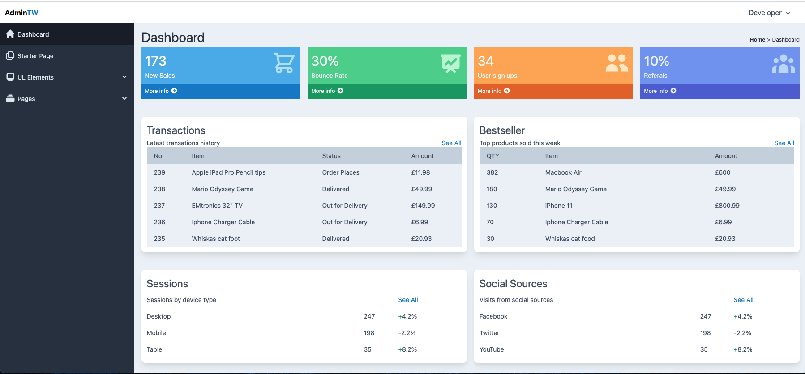

# AdminTW

The theme sources files are located in public.



## Run Tailwind
The original source files to run Tailwind has been included to enable you to run the same setup.

To run the source files follow these steps:

1) Download or clone this repo, moving into the root and install NPM

```js
npm install
```

Watch the html files as you make changes. You can install NPM Live-Server to watch for changes in html files and auto reload the pages.

to install Live Server globally:

```js
npm install -g live-server
```

Then to run and watch the public folder:

```js
live-server public
```

## Getting ready for deployment

For production the stylesheet will need to be perged of all unused CSS classes.

To do this open postcss.config.js then uncomment:
```js
/*require('@fullhuman/postcss-purgecss')({
    content: [
      './public/*.html'
    ],
    defaultExtractor: content => content.match(/[A-Za-z0-9-_:/]+/g) || []
})*/
```

To it looks like this:

```js
require('@fullhuman/postcss-purgecss')({
    content: [
      './public/*.html'
    ],
    defaultExtractor: content => content.match(/[A-Za-z0-9-_:/]+/g) || []
})
```

Then install NPM if you haven't already by running 

```js
npm install
````

Next recompile the styles.css by running 

```js
npm run build
```

this will then remove all unused styles from tailwind into the public/css/tailwind.css file. 

>This should only be done for deployment. 
